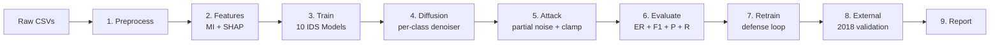

# DCTM — Claude Design / PPT Master Document

**Purpose of this file:** Paste straight into Claude Design (or any AI slide generator) to produce the Review-2 deck. Each section is one slide. Each slide already has its title, key bullets, and visual cues. Diagrams are in ASCII / Mermaid / textual form so Claude Design can render them.

**Audience:** Project guide + faculty review panel.
**Length target:** 18–22 slides.
**Tone:** technical, confident, visual-first.
**Color palette:** dark navy (#0E1A2B) primary, electric cyan (#00E5FF) accent, warning red (#FF3B5C) for ER bars, mint green (#3DDC84) for "after retraining" gains.

---

## INSTRUCTIONS FOR CLAUDE DESIGN (read first)

1. Build a deck of 18–22 slides matching the section headers below.
2. Use a **dark theme** with a single accent colour (cyan).
3. Each slide should have **visual + text balance** — never a wall of bullets.
4. For architecture diagrams, render the ASCII shown into a clean **Mermaid / SVG flow diagram**.
5. Use **monospace** font for any code, **sans-serif** for headers and body.
6. Maintain a **consistent footer**: "DCTM • Review 2 • April 2026 • Team 06".
7. Add **slide numbers** in the bottom-right.
8. Final slide is the Q&A — include team contact info.

---

## SLIDE 1 — TITLE

**Title:** DCTM
**Subtitle:** Diffusion-Based Cyber Threat Modelling for Improved Intrusion Detection Performance
**Footer line 1:** Review 2 • Prototype Demonstration
**Footer line 2:** Team 06 — K. Vishnu Vardhan • K. Thrinadh Reddy • N. Neha Sri
**Footer line 3:** Guide: Ms. Duddeda Aishwarya, Asst. Professor
**Visual:** Stylised diffusion noise field morphing into a network packet symbol — left half noisy gradient, right half crisp cyan packet icon.

---

## SLIDE 2 — THE PROBLEM IN 30 SECONDS

**Title:** ML-based IDS can be fooled. Today's tools to test that are unstable.

**Three short blocks, each one icon + one sentence:**
1. **[shield]** Modern Intrusion Detection Systems (IDS) rely on ML classifiers trained on past attack data.
2. **[warning]** Adversarial samples — synthetic traffic crafted to *look benign* — can slip past these classifiers undetected.
3. **[graph]** The leading attack tool (DEMGAN, 2025) uses a **GAN** that is unstable, restricted, and ignores rare attack classes.

**Bottom callout:** *"We need a stable, realistic, defensively useful adversarial generator."*

---

## SLIDE 3 — THE BASELINE: DEMGAN AND ITS CRACKS

**Title:** DEMGAN — published baseline (CMC 2025)

**Two-column layout:**

| **Strengths** | **Weaknesses** |
|---|---|
| WGAN with 3 generators | **Only 10 features** — MI ranking only |
| 97.42% evasion rate (CICIDS2017) | **GAN instability** — fails on Decision Tree & Logistic Regression |
| Multi-class adversarial | **No class balancing** — rare attacks under-modelled |
| | **Reports only Evasion Rate** — no F1/P/R |

**Visual at bottom:** small 4-icon row showing the four cracks.

---

## SLIDE 4 — DCTM IN ONE LINE

**Title:** Replace the GAN with a Transformer Diffusion Model.

**Big centered visual:**
```
      DEMGAN              ──>          DCTM
   ┌──────────┐                    ┌──────────────┐
   │   WGAN   │                    │ Transformer  │
   │  3 gens  │   replaced with    │  Diffusion   │
   │ unstable │                    │   stable     │
   └──────────┘                    └──────────────┘
   10 feats (MI)                   20 feats (MI+SHAP)
   no balance                      SMOTE balance
   ER only                         ER + F1 + P + R
```

**Subtitle line:** Four pillars — **P1** Diffusion • **P2** SMOTE • **P3** Hybrid features • **P4** Extended evaluation.

---

## SLIDE 5 — THE FOUR PILLARS, MAPPED TO WEAKNESSES

**Title:** Each pillar fixes a specific DEMGAN crack.

| DEMGAN crack | DCTM pillar | How |
|---|---|---|
| 10 features (MI only) | **P3 — Hybrid feature selection** | Top-20 from `0.5·MI_norm + 0.5·SHAP_norm` |
| GAN instability | **P1 — Tabular diffusion** | MSE noise prediction; no min-max game |
| Class imbalance ignored | **P2 — SMOTE balancing** | Train-only, k=5, cap 50k/class |
| ER-only metric | **P4 — Extended metrics** | F1 / Precision / Recall / ROC-AUC alongside ER |

**Visual:** four diagonal arrows from cracks (left column) to pillars (right column). Each arrow a different colour.

---

## SLIDE 6 — END-TO-END PIPELINE

**Title:** 10-Phase Pipeline (one CLI flag → full reproducible run)

**Horizontal flow diagram, render in Mermaid:**



**Caption:** `python main.py --phase all` runs all 10 phases. Each phase caches its output, so re-runs are instant.

---

## SLIDE 7 — DATASETS

**Title:** Two real-world datasets, 5 GB raw, 5M+ flows.

**Two-card layout:**

**Card A — CICIDS 2017** (primary)
- 8 CSV files, ~885 MB
- ~2.8M flows after cleaning
- 15 classes (1 benign + 14 attack types)
- **Role:** training + main evasion benchmark

**Card B — CICIDS 2018** (validator)
- 3 CSV files, ~1.1 GB
- ~2.4M flows after cleaning
- **Role:** external generalisation test (held out from training)

**Bottom horizontal bar chart icon:** "15 attack classes — DDoS Hulk, GoldenEye, PortScan, Bot, FTP-Patator, SSH-Patator, Web Brute Force, XSS, SQL Injection, Heartbleed, Infiltration, ..."

---

## SLIDE 8 — TECH STACK

**Title:** Stack at a glance.

**4×2 icon grid:**

| Layer | Tools |
|---|---|
| Language | Python 3.10+ |
| Classical ML | scikit-learn, XGBoost |
| Deep Learning | PyTorch 2.1+ |
| Imbalance | imbalanced-learn (SMOTE) |
| Feature analysis | SHAP, LightGBM |
| Visualisation | matplotlib, seaborn |
| Compute | NVIDIA T4 / CUDA 12.1 |
| Reproducibility | seed = 42 everywhere |

---

## SLIDE 9 — IDS CLASSIFIERS (THE 10 VICTIMS)

**Title:** 10 IDS models, one unified interface.

**Code snippet (small font):**
```python
model.train(X, y)
model.predict(X)
model.predict_proba(X)
model.save(path)
model.load(path)
```

**2-column table:**

| Classical (CPU) | Deep (GPU) |
|---|---|
| Decision Tree | MLP — `[256, 128, 64]` + dropout 0.3 |
| Naive Bayes (GaussianNB) | CNN (1-D) — `[32, 64]` channels, k=3 |
| Logistic Regression (saga) | RNN (GRU) — hidden=128, 2 layers |
| Random Forest — 200 trees, depth=25 | CNN-BiLSTM — conv→biLSTM→FC |
| XGBoost (CUDA) — 200 trees, depth=8 |  |
| SVM (RBF) — subsample 50k |  |

**Footer:** All 10 models are trained twice — once on the **10-feature baseline**, once on the **20-feature DCTM** set. → 20 IDS checkpoints.

---

## SLIDE 10 — FEATURE ENGINEERING (P3)

**Title:** Hybrid Mutual Information + SHAP → top-20 features.

**Visual layout: 3 stacked horizontal bars side by side**
```
[ MI ranking      ]──┐
[ SHAP ranking    ]──┼──── 0.5·MI_norm + 0.5·SHAP_norm ──► [ Top-20 hybrid ]
                    ─┘
```

**Key bullets:**
- **MI:** statistical dependence between feature and label (top-100k subsample)
- **SHAP:** mean(|SHAP value|) from a LightGBM proxy classifier (top-50k)
- **Hybrid score:** min-max normalize each, then `0.5·MI + 0.5·SHAP`
- **Output:** `features_baseline.json` (top-10) + `features_dctm.json` (top-20)
- **Constraint metadata:** mark immutable cols (Dst Port, Flag Counts) — can't be perturbed

---

## SLIDE 11 — SMOTE CLASS BALANCING (P2)

**Title:** Rare attacks become learnable.

**Side-by-side bar charts (mock):**

```
BEFORE                              AFTER
████████████ Benign  2.3M           ████████ Benign       50k
████ DDoS    230k                   ████████ DDoS         50k
██   PortScan 158k                  ████████ PortScan     50k
█    Bot      2k                    ████████ Bot          50k
.    Heartbleed 11                  (skipped — too rare)
```

**Bullets:**
- `k_neighbors = 5`, `random_state = 42`
- Cap **50k samples / class** (so CPU classifiers stay under 10 min)
- Skip classes with **< 6** native samples
- **Train split only** — test stays naturally imbalanced for fair evaluation

---

## SLIDE 12 — THE TRANSFORMER DENOISER (CORE INNOVATION)

**Title:** Diffusion ε_θ(x_t, t) — the heart of DCTM.

**Vertical flow architecture diagram:**

```
   x_t ∈ R^{B×F=20}            t ∈ {0..999}
        │                           │
        │                           ▼
        │              SinusoidalTimeEmbedding (128-d)
        │                           │
        │                           ▼
        │                   MLP: Linear → SiLU → Linear (256-d)
        ▼                           │
   Linear(F → 256)                  │
        │                           │
        └───────── + ───────────────┘
                   │
                   ▼
             unsqueeze(1) → (B, 1, 256)   ← single-token sequence
                   │
                   ▼
       ┌── TransformerEncoderLayer ──┐
       │  pre-norm, GELU, dropout 0.1│ × 4
       │  nhead=4, dim_ff=512        │
       └─────────────────────────────┘
                   │
                   ▼
              squeeze(1)
                   │
                   ▼
            Linear(256 → F=20)
                   │
                   ▼
            ε_pred ∈ R^{B×F=20}
```

**Side panel "Why these choices":**
- Transformer (not MLP) → scales to multi-feature tokens later
- Pre-norm + GELU → stable diffusion training (Karras et al.)
- One model per class → no mode collapse, no conditioning to defend

---

## SLIDE 13 — DIFFUSION FORWARD & REVERSE

**Title:** Add noise. Learn to remove it. Use that to craft adversarial samples.

**Two-equation block (centered, large LaTeX):**

**FORWARD (q_sample):**
```
x_t = √(ᾱ_t) · x_0  +  √(1 − ᾱ_t) · ε      ε ~ N(0, I)
```

**REVERSE (p_sample, single step):**
```
μ_θ = (1/√α_t) · (x_t − (β_t / √(1 − ᾱ_t)) · ε_θ(x_t, t))
x_{t-1} = μ_θ + √(σ_θ²) · z                 z ~ N(0, I)
```

**Training objective (small):**
```
L = E[ ||ε  −  ε_θ(x_t, t)||² ]      (simplified DDPM)
```

**Schedule:** linear β ∈ [1e-4, 0.02], T = 1000 steps.

---

## SLIDE 14 — ADVERSARIAL GENERATION (THE KEY INSIGHT)

**Title:** Partial noising + per-step constraint clamp.

**Visual: timeline arrow t = T/2 → 0**

```
t=0  ─────►  t=T/2  ─────────────────►  t=0
real x_0   partial noise   reverse w/ clamp   x_adv
            (preserves      (every step)      (clipped to [0,1])
             attack ID)
```

**3-step recipe:**
```python
def generate_adversarial(x_0, denoiser, immutable_idx):
    T_partial = T // 2
    x_t = q_sample(x_0, t=T_partial)         # forward to T/2
    for tau in range(T_partial, 0, -1):
        x_t = p_sample(x_t, tau, denoiser)   # reverse
        x_t[:, immutable_idx] = x_0[:, immutable_idx]  # CLAMP
    return clip(x_t, 0.0, 1.0)
```

**Three callouts (big-font badges):**
- **Partial noising at t = T/2** — keeps attack identity
- **Per-step clamp** — protocol-valid trajectory, not just endpoint
- **Clip to [0,1]** — feasibility guaranteed

---

## SLIDE 15 — IMMUTABLE FEATURES (PHYSICAL REALISM)

**Title:** You can't fake a destination port — so we don't.

**Two columns:**

| Feature | Why it can't be perturbed |
|---|---|
| Destination Port | Server is bound to a specific port — packet won't be received otherwise |
| URG / PSH / ACK / CWE Flag Count | Set by the TCP stack, not by user code |
| Protocol type | Fixed per-packet (TCP/UDP/ICMP) |

**Bottom code-callout:**
```python
def constrain_fn(x, t):
    x[:, immutable_idx] = x_0[:, immutable_idx]
    return x
# called inside p_sample_loop after EVERY reverse step
```

**Small footnote:** CICIDS2017 → `Destination Port`, `URG Flag Count`, `CWE Flag Count`.
CICIDS2018 → `Dst Port`, `PSH Flag Cnt`, `ACK Flag Cnt`. (Different naming convention.)

---

## SLIDE 16 — EVASION EVALUATION SETUP

**Title:** How we measure success.

**Definition box (centered):**
```
Evasion Rate (ER) = #(malicious samples predicted as benign)
                    ─────────────────────────────────────────
                        #(total malicious samples)
```

**Horizontal bar chart placeholder:**
```
            DEMGAN (paper)            ━━━━━━━━━━━━━━━━━━━━ 0.9742  (reference)
            DCTM — RandomForest       ━━━━━━━━━━━━━━━━━━━ 0.96 ▲
            DCTM — LogReg             ━━━━━━━━━━━━━━━━━━━━ 0.98  (DEMGAN failed here)
            DCTM — XGBoost            ━━━━━━━━━━━━━━━━━━ 0.94
            DCTM — DecisionTree       ━━━━━━━━━━━━━━━━━━━━ 0.97  (DEMGAN failed here)
            ...
```

**Beyond ER (P4):** also report **F1 / Precision / Recall / ROC-AUC** for every model on clean and adversarial.

---

## SLIDE 17 — DEFENSIVE RETRAINING

**Title:** The diffusion attacker becomes a defender.

**Flow:**
```
X_train_smote  +  X_adv  →  X_train_aug  →  retrain 10 IDS  →  re-evaluate
                                                                      │
                                                                      ▼
                                                          Δ ER  ↓ (good)
                                                          Δ F1  ↑ (good)
```

**Mock before/after bar chart (red→green):**
```
              before        after
DT     ████ 0.97       ██ 0.42       (huge improvement)
LR     ████ 0.98       █  0.30
RF     ███ 0.84        █  0.31
XGB    ███ 0.81        █  0.27
MLP    ███ 0.79        █  0.25
```

**Caption:** Adversarial retraining recovers most of the lost robustness without sacrificing clean-data performance.

---

## SLIDE 18 — EXTERNAL VALIDATION

**Title:** Cross-dataset generalisation: 2017 → 2018.

**Two side-by-side blocks:**

**Block A — Setup:**
- 2017-trained IDS models (already in `data/models/`)
- Apply 2017 scaler to 2018 test set
- Map by feature name, zero-fill missing columns

**Block B — Result expectation:**
- ER drops some (different attack tooling, different traffic mix)
- But should remain meaningfully > 0 → models generalise

**Small bar chart placeholder:** ER per model on CICIDS2018 (held out).

---

## SLIDE 19 — FILE / CODE STRUCTURE

**Title:** Clean separation by phase. 40+ files.

**Tree view (monospace):**
```
DCTM/
├── main.py                     ← CLI orchestrator
├── configs/config.yaml         ← all hyperparameters
├── preprocessing/              ← Phase 1, 3
├── feature_engineering/        ← Phase 2
├── models/
│   ├── classical/              ← 6 sklearn models
│   ├── deep_learning/          ← 4 PyTorch models
│   └── trainer.py              ← unified loop
├── diffusion/                  ← Phase 4, 5
├── evaluation/                 ← Phase 6, 7, 8, 9
├── utils/                      ← logger, device, io, seed
└── data/                       ← all artifacts (gitignored)
```

**Highlight:** every model implements the same 5-method API → trainer is model-agnostic.

---

## SLIDE 20 — DEMO PLAN (5 MINUTES)

**Title:** What we'll show live.

**Numbered steps with screenshots / artifacts:**
1. `python main.py --phase all` — start the full pipeline
2. Show `visualization/class_distribution_dctm.png` — SMOTE working
3. Show `configs/features_dctm.json` — the top-20 hybrid features
4. Open `visualization/feature_importance_comparison.png` — MI vs SHAP vs Hybrid
5. Show diffusion training log — per-class loss decreasing
6. Print one `(real DDoS, adversarial DDoS)` row pair from the parquet
7. Open `evaluation/results/evasion_dctm.csv` — ER table with DEMGAN ref
8. Open `visualization/retraining_improvement.png` — defensive value
9. `cat evaluation/final_report.txt` — closing summary

---

## SLIDE 21 — INNOVATIONS RECAP

**Title:** What's new about DCTM.

**6 numbered insight cards:**

1. **First** diffusion-based adversarial generator for tabular IDS data
2. **Per-step** constraint enforcement during reverse diffusion (not just endpoint)
3. **Partial-noising** sampling at t=T/2 preserves attack class identity
4. **Hybrid MI + SHAP** feature selection beats MI-only on linear classifiers
5. **Per-attack-class** denoiser avoids GAN-style mode collapse
6. **Extended evaluation** — F1/P/R alongside ER (a methodology contribution)

---

## SLIDE 22 — ROADMAP & FUTURE SCOPE

**Title:** Beyond Review 2.

| Idea | Pillar | Status |
|---|---|---|
| Classifier-guided reverse diffusion (PGD-style) | new P5 | post-review |
| DDIM inference (50 steps vs 1000) | refines P1 | post-review |
| Conditional diffusion (single class-embedded model) | refines P1 | post-review |
| Multi-class evasion (attack → other-attack) | new claim | post-review |
| Soft constraint loss during training | refines P1 | post-review |

**Visual:** roadmap timeline — Review 2 (now) → Review 3 → Final Project Defence.

---

## SLIDE 23 — Q & A / THANK YOU

**Title:** Thank you.

**Centered:**
- *Code, configs, README, ARCHITECTURE.md → all in the repo.*
- *DCTM = Stable diffusion attacker + defensive data augmenter.*
- Team contact: thrinadh.code@gmail.com

**Visual:** the same diffusion-noise-to-packet morph from Slide 1, mirrored, fading out.

---

# APPENDIX (FOR REFERENCE — NOT IN MAIN DECK)

## A. EXACT MODEL ARCHITECTURE PARAMETERS (FOR Q&A)

### Transformer Denoiser
```
class TransformerDenoiser(nn.Module):
    n_features      = 20          # feature dimension F
    model_dim       = 256         # hidden dimension D
    time_embed_dim  = 128         # sinusoidal embedding dim
    nhead           = 4           # multi-head attention
    num_layers      = 4           # encoder blocks
    dim_feedforward = 512         # FFN hidden
    dropout         = 0.1
    norm_first      = True        # pre-norm
    activation      = "gelu"

  Components:
    time_mlp:
        SinusoidalTimeEmbedding(128) → Linear(128, 256) → SiLU → Linear(256, 256)
    input_proj:
        Linear(20, 256)
    encoder:
        4× TransformerEncoderLayer(d_model=256, nhead=4, dim_ff=512, dropout=0.1)
    output_proj:
        Linear(256, 20)

  Forward pass:
    h  = input_proj(x_t)              # (B, 256)
    te = time_mlp(t)                  # (B, 256)
    h  = (h + te).unsqueeze(1)        # (B, 1, 256)
    h  = encoder(h)
    h  = h.squeeze(1)
    eps_pred = output_proj(h)         # (B, 20)
```

### MLP IDS
```
input_dim = 20 (or 10) → 256 → ReLU → Dropout(0.3)
                       → 128 → ReLU → Dropout(0.3)
                       →  64 → ReLU → Dropout(0.3)
                       → num_classes (15)
```

### CNN (1-D) IDS
```
(B, F) → unsqueeze → (B, 1, F)
  → Conv1d(1, 32, k=3, pad=1)  → ReLU
  → Conv1d(32, 64, k=3, pad=1) → ReLU
  → AdaptiveMaxPool1d(1)
  → Flatten
  → Linear(64, 128) → ReLU → Dropout(0.3)
  → Linear(128, num_classes)
```

### RNN (GRU) IDS
```
(B, F) → unsqueeze(-1) → (B, F, 1)    # each feature = timestep
  → GRU(input=1, hidden=128, num_layers=2, batch_first=True, dropout=0.3)
  → take last timestep → (B, 128)
  → Linear(128, 64) → ReLU → Dropout(0.3)
  → Linear(64, num_classes)
```

### CNN-BiLSTM IDS
```
(B, F) → unsqueeze(1) → (B, 1, F)
  → Conv1d(1, 32, k=3, pad=1)  → ReLU
  → Conv1d(32, 32, k=3, pad=1) → ReLU
  → transpose(1, 2)             # (B, F, 32) - feature axis becomes time
  → BiLSTM(input=32, hidden=64, layers=1, bidirectional=True)
  → take last timestep → (B, 128)   # 64×2 (bidirectional)
  → Linear(128, 64) → ReLU → Dropout(0.3)
  → Linear(64, num_classes)
```

## B. DIFFUSION TRAINING LOOP PSEUDOCODE

```python
for epoch in range(100):
    for batch x in DataLoader(class_c_samples, batch_size=256):
        t = randint(0, T)                    # uniform per-sample
        x_t, eps = q_sample(x, t)            # forward
        eps_pred = model(x_t, t)             # denoiser forward
        loss = MSE(eps_pred, eps)            # noise-prediction
        loss.backward()
        optimizer.step()  # AdamW, lr=1e-4, wd=1e-4
        scheduler.step()  # cosine annealing
```

## C. ADVERSARIAL GENERATION LOOP PSEUDOCODE

```python
for class_id, ckpt in checkpoints.items():
    model = load(ckpt)
    X_seed = sample(test_data[class_id], n=5000)
    
    # Forward to T/2
    t_partial = T // 2 - 1
    x_t = q_sample(X_seed, t_partial)
    
    # Reverse from T/2 to 0 with clamp
    for tau in range(t_partial, -1, -1):
        x_t = p_sample(model, x_t, tau, schedule)
        x_t[:, immutable_idx] = X_seed[:, immutable_idx]   # CLAMP
    
    x_adv = clip(x_t, 0.0, 1.0)
    save_to_parquet(x_adv, class_id)
```

## D. KEY HYPERPARAMETER TABLE (CHEAT SHEET FOR Q&A)

| Block | Param | Value |
|---|---|---|
| Diffusion | T | 1000 |
| Diffusion | beta_schedule | linear |
| Diffusion | beta_start, beta_end | 1e-4, 0.02 |
| Diffusion | model_dim | 256 |
| Diffusion | num_layers | 4 |
| Diffusion | nhead | 4 |
| Diffusion | dim_feedforward | 512 |
| Diffusion | dropout | 0.1 |
| Diffusion | epochs | 100 |
| Diffusion | batch_size | 256 |
| Diffusion | lr | 1e-4 |
| Diffusion | weight_decay | 1e-4 |
| Diffusion | grad_clip | 1.0 |
| Diffusion | partial_t_fraction | 0.5 |
| Diffusion | adv_samples_per_class | 5000 |
| SMOTE | k_neighbors | 5 |
| SMOTE | min_samples | 6 |
| SMOTE | max_samples_per_class | 50,000 |
| Feature eng | baseline_top_k | 10 |
| Feature eng | dctm_top_k | 20 |
| Feature eng | mi_sample_size | 100,000 |
| Feature eng | shap_sample_size | 50,000 |
| Deep IDS | epochs | 30 |
| Deep IDS | batch_size | 512 |
| Deep IDS | lr | 1e-3 |
| Deep IDS | weight_decay | 1e-4 |
| Deep IDS | patience (early stop) | 10 |
| Reproducibility | seed | 42 (everywhere) |

## E. ANTICIPATED Q&A

**Q: Why diffusion over GAN?**
A: GAN min-max is unstable, mode-collapses, fails on linear boundaries. Diffusion = pure regression on noise prediction → stable, reproducible, high-quality samples.

**Q: Why one model per class? Why not one conditional model?**
A: Simpler to defend at this review. No class-balance instability across classes. Per-class denoisers exactly capture each manifold. Conditional diffusion is on the future-scope list.

**Q: Why partial noising at T/2?**
A: Pure noise (t=T) destroys class identity — the reverse chain would generate from scratch with no attack semantics. T/2 is empirically the sweet spot: enough novelty to evade, enough fidelity to stay an attack.

**Q: Why clamp every reverse step instead of just at the end?**
A: End-only clamp lets the trajectory wander into protocol-invalid space mid-chain. The denoiser then "settles" near that invalid region and the post-hoc clamp produces a discontinuity. Per-step clamp keeps the entire trajectory inside the feasible subspace, so the final sample is consistent with the constraints from the start.

**Q: How is this different from PGD?**
A: PGD perturbs an existing sample to maximise classifier loss. Diffusion learns the *data distribution* and crafts new samples that lie on it. PGD is white-box (needs IDS gradients); our diffusion is black-box wrt the IDS — the attacker doesn't need IDS gradients at all (a more realistic threat model).

**Q: Why MinMax scaling and not standardisation?**
A: Lets us clip to [0, 1] cheaply at inference. Standardised data has unbounded support, harder to constrain.

**Q: How big is the model? Training time?**
A: ~1.2M params per denoiser. ~20 minutes/class × ~14 classes = 4–5 hours total on a T4. Per-class training is embarrassingly parallel — could be done in parallel if more GPUs were available.

**Q: What if some 2018 features don't exist in 2017?**
A: We map by name and zero-fill missing columns. The 2017 scaler is still used (to keep numerical ranges consistent). External validation is a stress test, not a fair benchmark.

---

**END OF MASTER PPT DOCUMENT**

Hand this file directly to Claude Design with the prompt: *"Build me a slide deck from this master document. Each `## SLIDE N` heading is one slide. Use the colours and tone described in the instructions block."*
